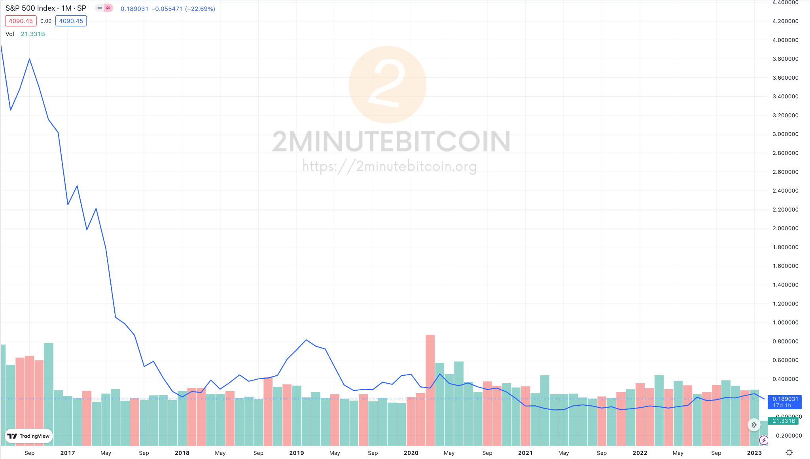
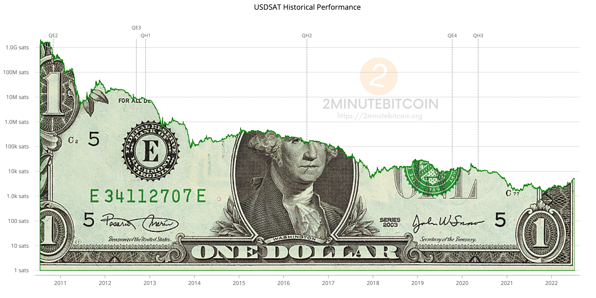

Bitcoin’s utility as a unit of account **today** depends on what you already believe about Bitcoin.

If you are skeptical of Bitcoin, it makes no sense to use it as a unit of account.

If you believe that Bitcoin will become the world currency, it makes no sense to use anything else.

If you want to end up with as many bitcoins as possible, you should price any investments or ventures in Bitcoin. 

That’s how you know if you are winning or losing against your benchmark. 

> “is it going to get me more bitcoins in the future”?

# Bitcoin as a Unit of Account
There is **no objective unit of value** that is measured with a unit of account.

It is all a matter of perspective, and relative value - how valuable is **this unit** relative to the unit of account.

Someone still lost in the dollar world looks at Bitcoin and sees wild and extreme volatility, whereas someone in Bitcoin looking back at the dollar sees a crash and subsequent bleed/stagnation.

*S&P 500 priced in Bitcoin*

*$1 denominated in sats*

# Bitcoin Accountancy
Within the Bitcoin world - it is pretty straightforward to use it as a unit of account.

A [Bitcoin mining company](https://www.2minutebitcoin.org/blog/stone-ridge-2020-shareholder-letter) cares about one thing - did the mining equipment and electricity cost more bitcoins than they produce?

Outside the Bitcoin world - using Bitcoin as a unit of account simply means the price of everything is continuously falling.  What’s the problem with that?

That’s just Bitcoin’s way of telling people to keep holding it throughout its [hyper monetization](https://www.2minutebitcoin.org/blog/bitcoin-hypermonetization-bubble-talk-2013).

-----------------------------------------------------------------------

# META
- Original Author: Daniel Krawisz
- Original Word Count: 817
- Original Posted Date: May 10, 2014
- Original Source: https://nakamotoinstitute.org/mempool/bitcoin-is-the-best-unit-of-account/
