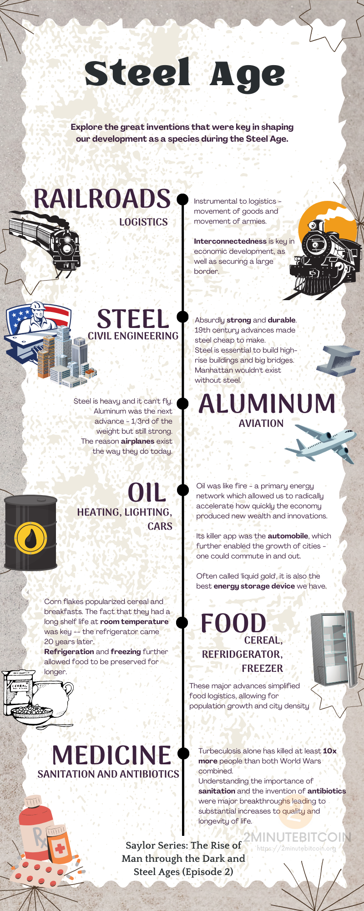

Technological advances and prosperity are **not** guaranteed. 

Things can be forgotten; society can regress.
- average life expectancy in Rome 100 A.D. was 72 years!
- Then, we turn to the Dark Age, and it plummets to 30 years.
- It took **~1840 years** to reach that again in the U.S.
- In 100 A.D., the [Romans](https://www.2minutebitcoin.org/blog/saylor-series-the-rise-of-man-through-the-stone-and-iron-ages-episode-1-2020) knew the world was round - then 1400 years later, Europe pre-Columbus thinks it’s flat
As powerful as these ideas are - they can be missed!

We are living in such an era with **[sound money](https://www.2minutebitcoin.org/blog/stone-ridge-2020-shareholder-letter)**.
Humanity has forgotten what it’s like to have money that doesn’t lose value and deludes itself into thinking such a world cannot work.

# Taxation & Religion
All great cities in history grew as a nexus of an empire. Through taxing a lot of commercial value on its territories, the main city can truly prosper.

Ancient Europeans fought themselves over control of the Mediterranean sea because the largest mercantile network in the world passed through there - the authority to act as its **gatekeeper** and **tax** it was a major prize.

Religion is closely tied to this - as people back in the day also paid taxes to the church.
The Reformation was largely motivated by the desire of foreigners to not send money to Rome for religious reasons.

# Intermediaries
The nature of an intermediary is one that can extract perpetual profits from anyone doing business in its network. 

History is rife with these - major train hub stations, major ports, large territorial empires - they get to tax anything that passes through them or does business directly in them.

Such gatekeepers are not only governments but also private monopolies or cartels.
- Rockefeller with Standard Oil - owned the whole end-to-end distribution of oil.
- Big Tech - Apple gets to tax **30%** of any transaction on their App store.
- Commercial banks get to tax any operation with money, including financial asset purchases (they’re often the only market maker)

Money itself is a network, which is why governments have been so keen to monopolize it - it gives them unlimited power over wealth.

# 1000x Advancements
The fundamental way we increase prosperity in society is through groundbreaking innovations that allow us to deliver **1000x** more energy - they massively dwarf any political moves.

Railroad, steel, aluminum, oil, food, and medicinal advances were all 1000x advances in their own right and are each key to defining life as we know it today.

All the companies involved in this were tech companies in their time.

# Industry Protocols
Shipping containers are the most efficient way to move anything on Earth.

They embody the principle of **[standardization](https://www.2minutebitcoin.org/blog/saylor-series-the-rise-of-man-through-the-stone-and-iron-ages-episode-1-2020)**. Every truck/ship/port follows the same protocol so that moving containers is plug-and-play.

 ----------------------------------------------------------------------

# META
- Original Author: Michael Saylor, Robert Breedlove, Stephen Chow
- Original Word Count: 13,457
- Original Posted Date: Nov 22, 2020 (recorded) / Feb 19, 2021 (transcribed)
- Original Source: https://chowcollection.medium.com/the-saylor-series-episode-2-the-rise-of-man-through-the-dark-and-steel-ages-a0abed12992e

